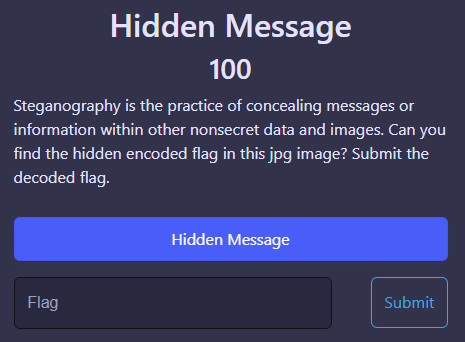
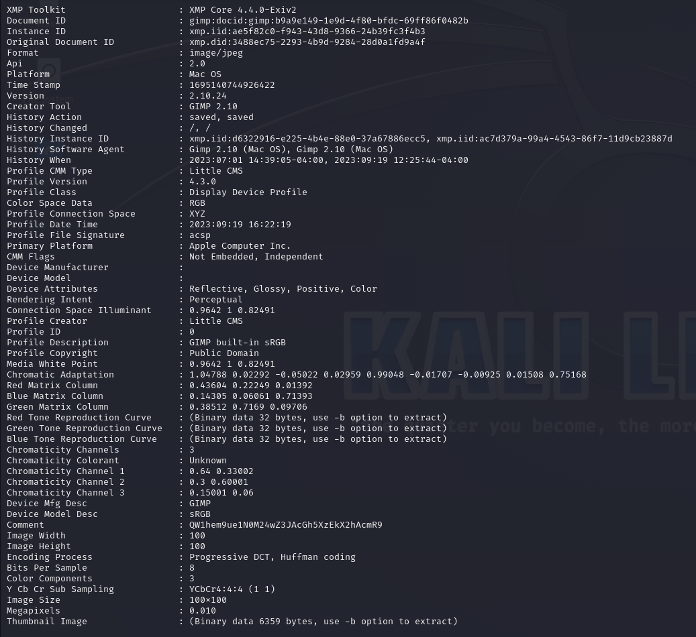
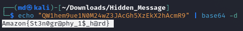

Challenges: Hidden Message
Points: 100
Category: Steg

Here, we are provided an image, logo.jpg. 

Let's use exiftool in Kali Linux to get more information about the image.

exiftool logo.jpg

We see the comment -> QW1hem9ue1N0M24wZ3JAcGh5XzEkX2hAcmR9. On decoding with Base64, we get the flag.

echo "QW1hem9ue1N0M24wZ3JAcGh5XzEkX2hAcmR9" | base64 -d

FLAG: Amazon{St3n0gr@phy_1$_h@rd} 