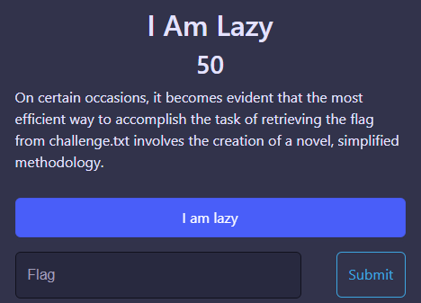
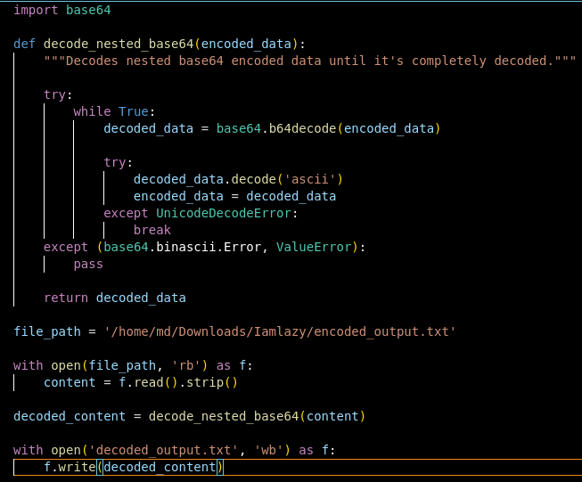
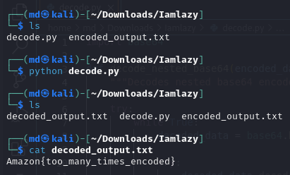

Challenge: Iamlazy
Points: 50
Category: Crypto

On checking the contents of encoded_output.txt, we can see that it is Base64 encoded, but we cant say how many times. So I wrote a python code to continously decode it until we get the flag.

My Code:

On running the python code, we get a file "decoded_output.txt" which contains the flag.

FLAG: Amazon{too_many_times_encoded}