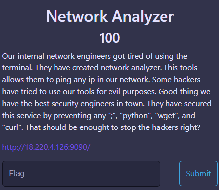
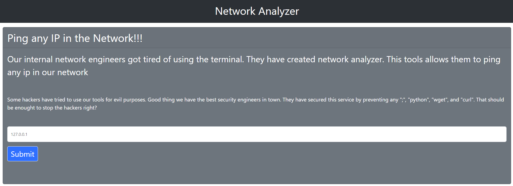
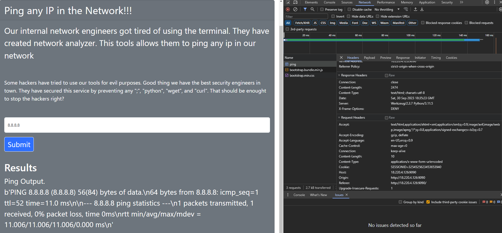
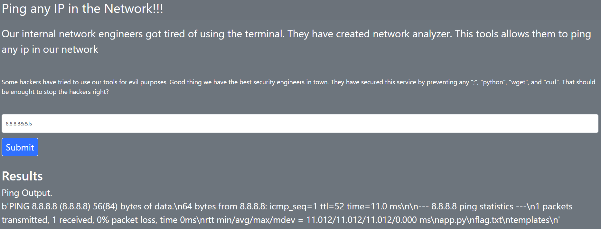
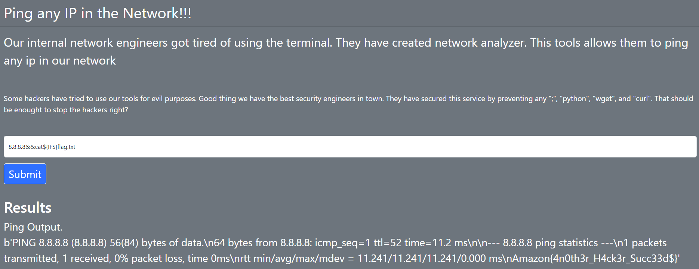

Challenge: Network Analyzer
Points: 100
Category: Web

First, lets do a normal ping to 8.8.8.8 to see the request and response headers.

So, we can see that in the Response Headers, the Server is marked as "Werkzeug/2.3.7 Python/3.11.5". Also, they have said that commands such as "wget", "curl", ";" and "python" are not allowed, hinting at the server being a Linux Server. The app allows us to add an IP Address and it runs the "ping" command using that IP address.

Let us try to add a simple command like "ls" too see if it works by chaining it with "&&" (The second command will only execute if the first command has executed successfully).

ping 8.8.8.8&&ls

We see that it works and the flag (flag.txt) is present in the same directory.

Now, let us try to view the contents of flag.txt. We use ${IFS} (Internal Field Separator) instead of a space here.

ping 8.8.8.8&&cat${IFS}flag.txt

FLAG: Amazon{4n0th3r_H4ck3r_Succ33d$}