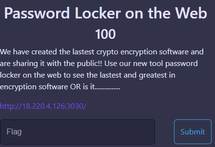
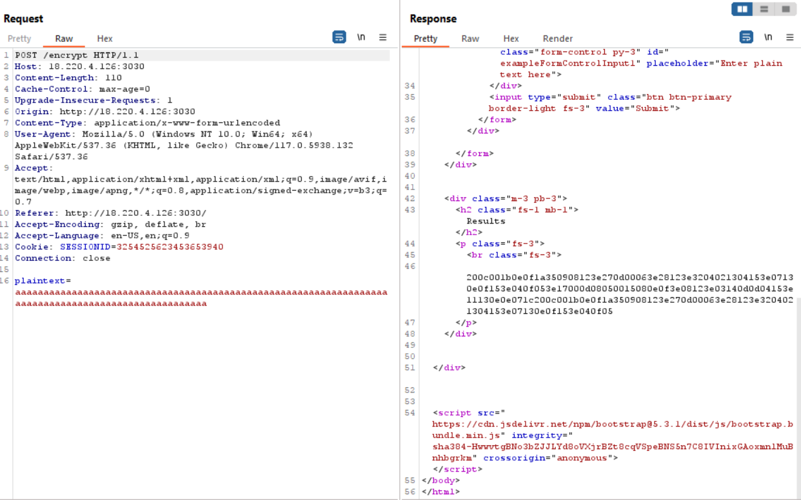

Challenge: Password Locker on the Web
Points: 100
Category: Web

To start, lets try to understand the application.

The way in which the results change help us to determine that this is not a hash and might be a different kind of cipher. Using Burp, let's enter 100 "a"s and try to see the change in the value.

Now, let's try to identify what kind of cipher this is. We will use https://www.dcode.fr/cipher-identifier for it.

Checking the suggestions, we finally reached XOR Cipher. Entering our value we got by using 100 a's as input, we see that we get the flag at 61.

FLAG: Amazon{This_Flag_Is_Secret_front_end_validation_is_bullet_proof}