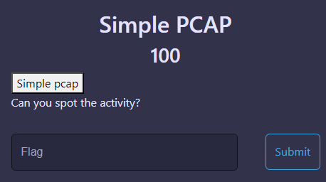
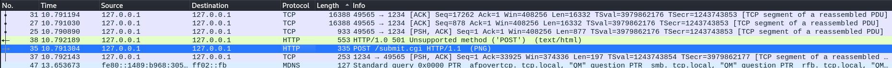
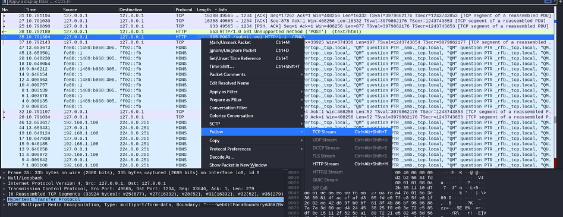
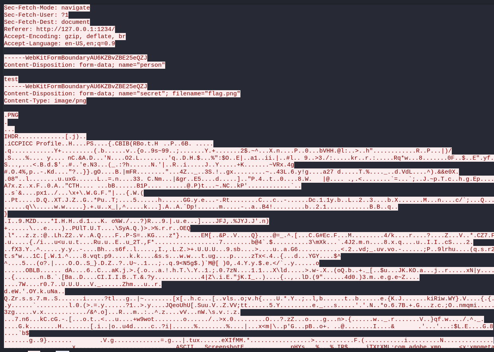
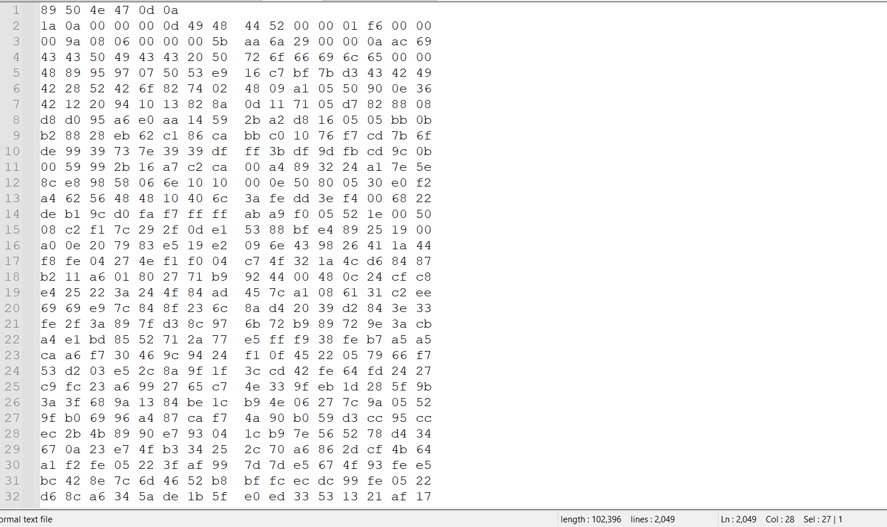
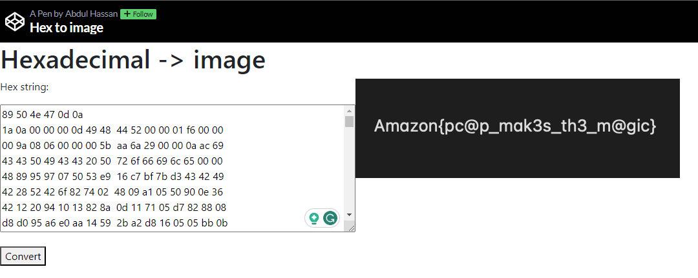

Challenge: Simple PCAP
Points: 100
Category: Networking

We have been provided with a pcap file. Let's analyze it in Wireshark.

First, let's order by the highest length and then check the POST requesst.

Let's follow the TCP Stream.

We see that a PNG file is present.

Let's save the conversation (127.0.0.0:49565 -> 127.0.0.1:1234 (33 kB)) as Hex Dump.

Remember, The first 8 bytes of a PNG file in hex should be 89 50 4E 47 0D 0A 1A 0A, and the last 8 bytes of a PNG file in hex should be 49 45 4e 44 ae 42 60 82.

Copy the hex dump and only keep the values between the start and end hex bytes mentioned above.

Now, paste the cleaned hex data at https://codepen.io/abdhass/full/jdRNdj (HEX to Image) and you get the PNG.

FLAG: Amazon(pc@p_mak3s_th3_m@gic)