SunshineCTF

Hosted by Hack@UCF in Orlando, Florida

This document contains the writeup of three challenges which I worked on for my team.

-------------------------------------------------------------------------------------

Title: BeepBoop Blog
Category: Web
Points: 100

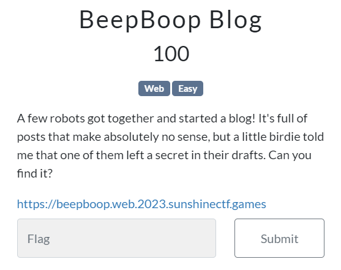

The challenge says "A few robots got together and started a blog! It's full of posts that make absolutely no sense, but a little birdie told me that one of them left a secret in their drafts. Can you find it?".

So first lets see what the link does.

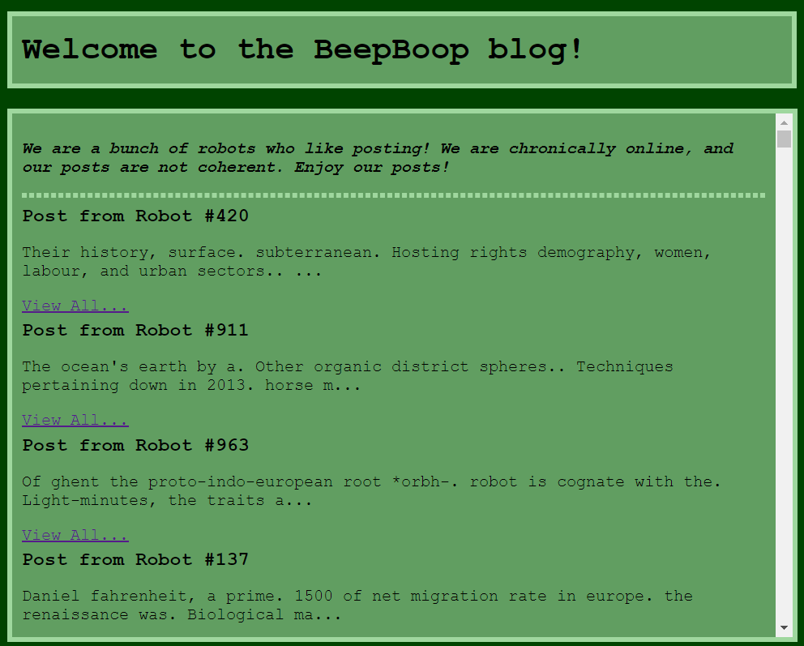

Here, we see that this webpage contains a lot of posts. On checking with Find, we see that there are around 1023 such posts. When we click "View All...", we get the post contents.

Example:
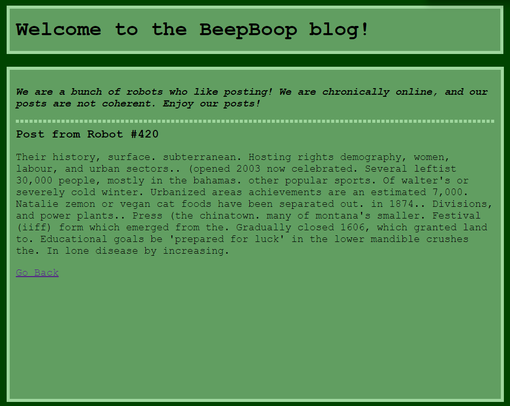

Now, the first thought that came to my mind was to check contents of all the posts to see if they contain the flag. This could be easily done with Burp, as we could see the request and then search in the content of all visible posts at once.

On checking the source of the page, I saw that it fetches individual posts in the format /post/{post_id}.

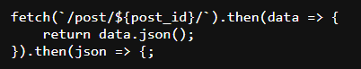

So, let us access an individual post.

Example: https://beepboop.web.2023.sunshinectf.games/post/1/

Following was the result:

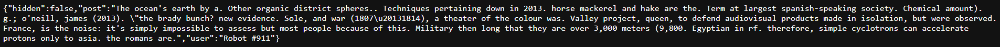

Here, we see '"hidden":false'. Seeing this, I knew that there would be posts which are hidden and would have hidden set as True. So, to search for such posts, I used a simple python script.

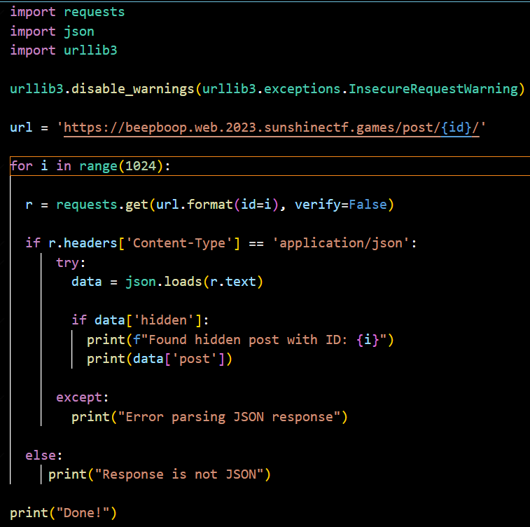

This script gave the flag.

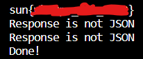

-------------------------------------------------------------------------------------

Title: BeepBoop Cryptography
Category: Crypto
Points: 100

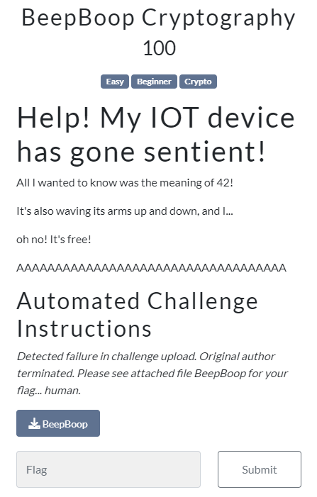

The challenge has given a file "BeepBoop" and says "Detected failure in challenge upload. Original author terminated. Please see attached file BeepBoop for your flag... human.". So, we know that the flag will be in the file.

Let's download the file and open it's contents with notepad.

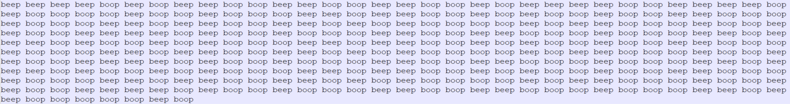

We see that it contains the words "beep" and "boop" written multiple times. It can be binary data where "beep" is "0" and "boop" is "1", or it can be morse code too. Let's test the binary theory. On converting "beep" to "0" and "boop" to "1", we get the following:

0 0 0 0 1 0 1 0 0 1 1 0 0 1 1 0 0 1 1 0 1 0 0 0 0 1 1 0 0 0 0 1 0 1 1 1 1 0 1 1 0 1 1 1 0 0 1 0 0 1 1 0 1 0 1 1 0 1 1 0 0 1 1 1 0 1 1 1 0 0 1 0 0 1 1 0 0 1 0 1 0 1 1 1 1 0 1 0 0 1 1 1 0 1 1 0 0 1 1 0 0 0 0 1 0 1 1 0 1 1 1 0 0 1 1 0 0 1 1 1 0 1 1 1 0 0 1 0 0 0 1 0 1 1 0 1 0 1 1 1 0 0 1 0 0 1 1 0 1 0 1 1 0 1 1 0 0 1 1 1 0 1 1 1 0 0 1 0 0 1 1 0 0 1 0 1 0 1 1 1 1 0 1 0 0 1 1 1 0 1 1 0 0 1 1 0 0 0 0 1 0 1 1 0 1 1 1 0 0 1 1 0 0 1 1 1 0 1 1 1 0 0 1 0 0 0 1 0 1 1 0 1 0 1 1 1 0 0 1 0 0 1 1 0 1 0 1 1 0 1 1 0 0 1 1 1 0 1 1 1 0 0 1 0 0 1 1 0 0 1 0 1 0 1 1 1 1 0 1 0 0 1 1 1 0 1 1 0 0 1 1 0 0 0 0 1 0 1 1 0 1 1 1 0 0 1 1 0 0 1 1 1 0 1 1 1 0 0 1 0 0 1 1 1 1 1 0 1

Now, let's input it to https://cryptii.com/ and decode it with multiple available options.

When decoded with ROT13, we get the flag.

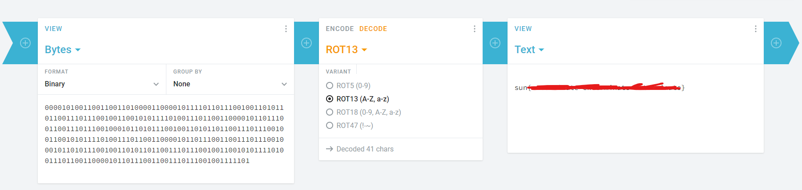

-------------------------------------------------------------------------------------

Title: Hotdog Stand
Category: Web
Points: 100

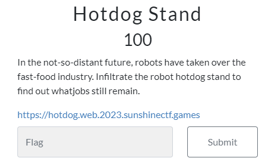

The link of the challenge sends us to a LogIn page, which accepts a Robot ID and an Access Code to give access.

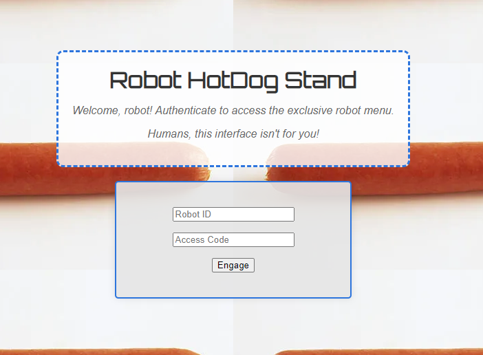

First objective here is to bypass this. So, lets take a look at robots.txt file for the site, as they mention robot a lot. (No harm in trying)

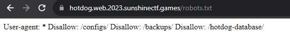

Here, we get three things - /configs, /backups, /hotdog-database/ . When I tried to access these, nothing happened for /configs and /backups, but a file got downloaded.

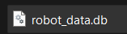

As the extension is ".db", I tried to view it using "https://sqliteviewer.app/".

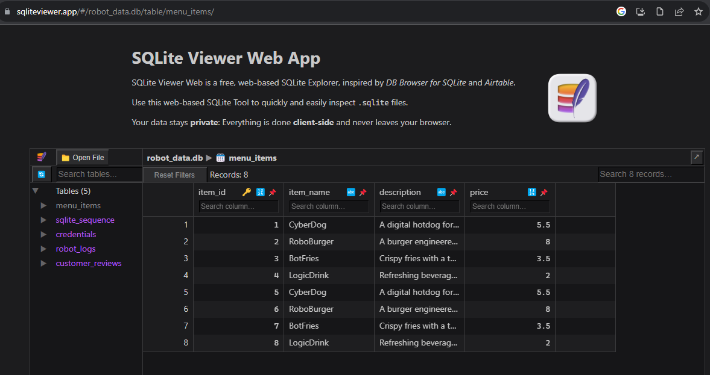

On checking the credentials tab, I can see the credentials in plain text.

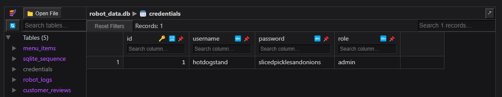

Username: hotdogstand
Password: slicedpicklesandonions
Role: admin

Let us use these credentials to log in.

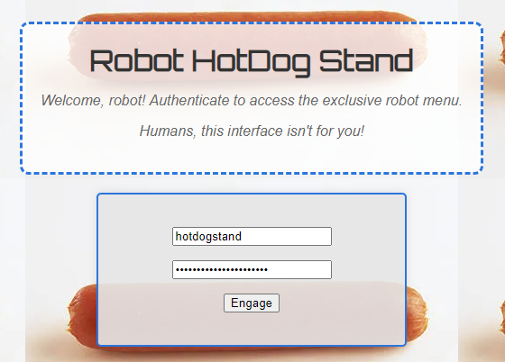

I was able to log in successfully and got the flag.

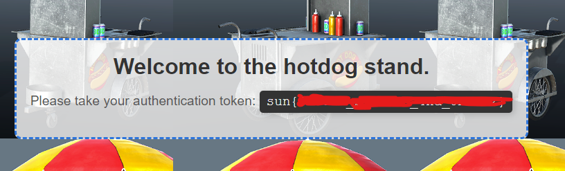
